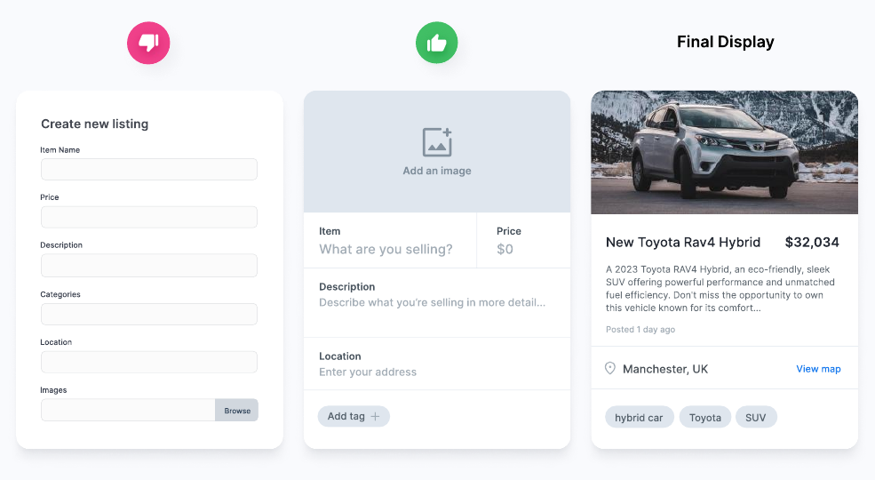
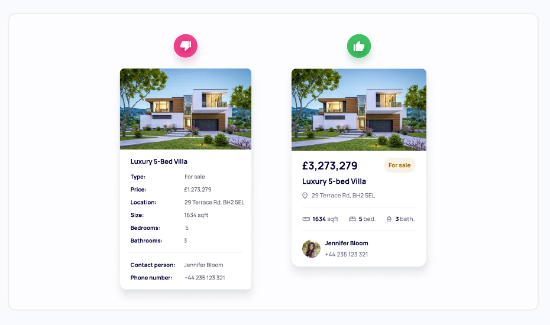
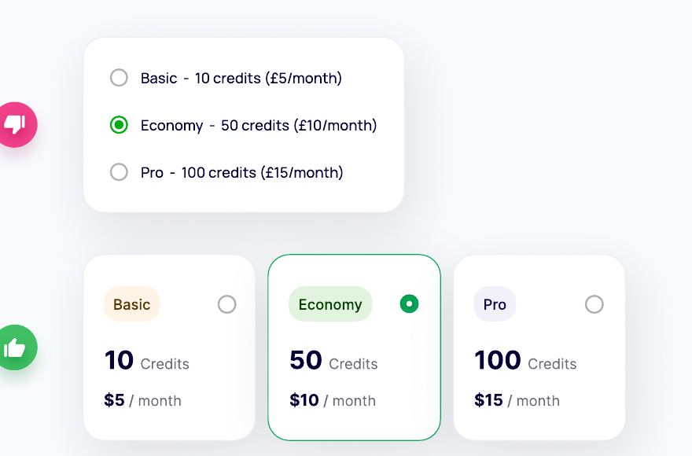
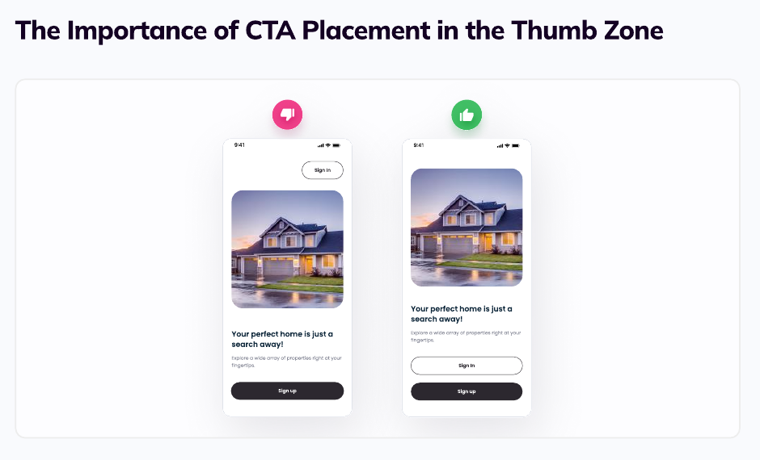
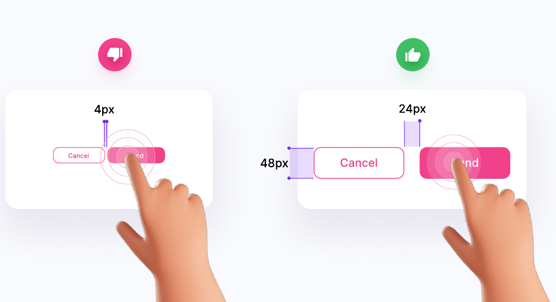
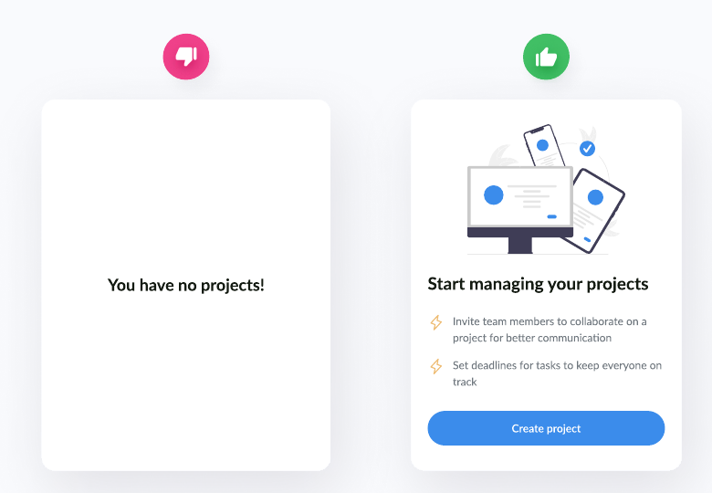
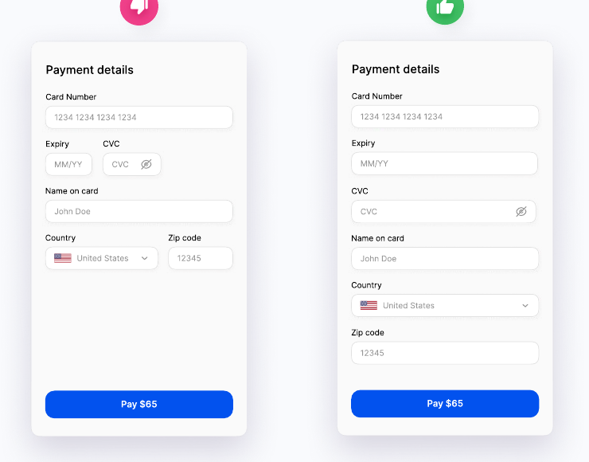
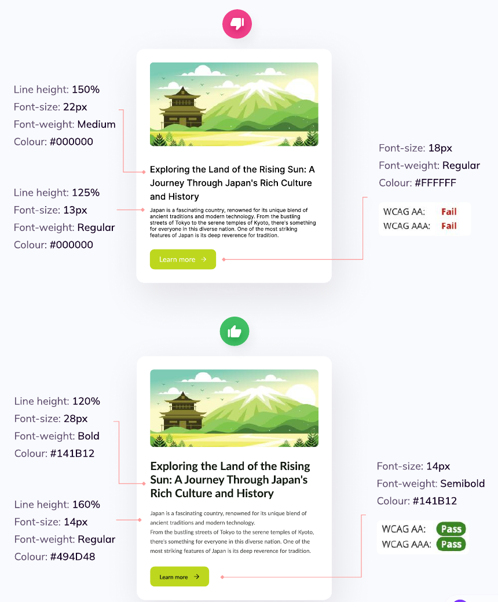
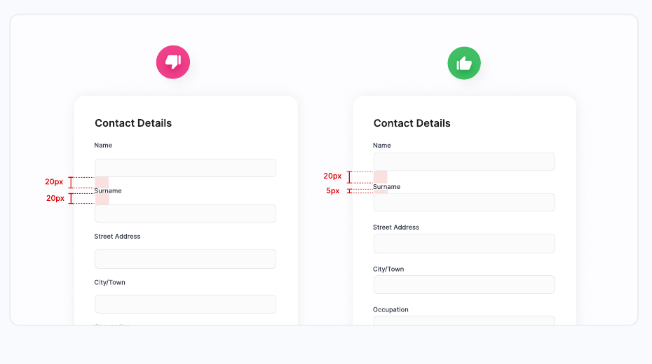
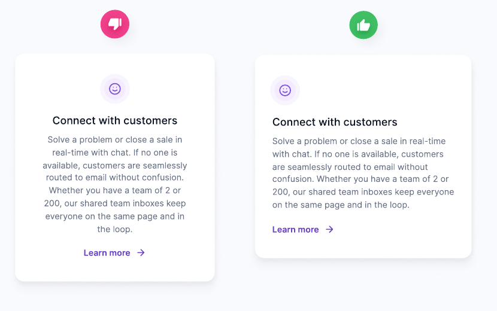

# Visual Exemplars

Use this reference to ground art direction in visible evidence. These are cropped teaching examples from the user-provided *The UI/UX Playbook* by Uxpeak, not templates to reproduce.

## How To Use The Board

- Open the relevant linked image with an image-viewing tool before coding; do not rely on the alt text or this analysis alone.
- Inspect at least two examples for a new surface or redesign and at least one for a localized pattern change.
- Extract the relationship being demonstrated: hierarchy, grouping, expected interaction, reading order, or reachability.
- Rebuild that relationship in the product's own brand, content, constraints, and design system.
- Never copy the source palette, illustrations, copy, exact dimensions, or ornamental treatment by default.

## Contents

1. [Make the form predict the result](#1-make-the-form-predict-the-result)
2. [Replace flat label-value rows with contextual hierarchy](#2-replace-flat-label-value-rows-with-contextual-hierarchy)
3. [Turn rich radio choices into comparable cards](#3-turn-rich-radio-choices-into-comparable-cards)
4. [Place frequent mobile actions within comfortable reach](#4-place-frequent-mobile-actions-within-comfortable-reach)
5. [Separate visual size from touch size](#5-separate-visual-size-from-touch-size)
6. [Give empty states a useful next step](#6-give-empty-states-a-useful-next-step)
7. [Group rich navigation and feature selectively](#7-group-rich-navigation-and-feature-selectively)
8. [Let field width reinforce expected data](#8-let-field-width-reinforce-expected-data)
9. [Coordinate type hierarchy, rhythm, and contrast](#9-coordinate-type-hierarchy-rhythm-and-contrast)
10. [Use proximity to make form grouping unambiguous](#10-use-proximity-to-make-form-grouping-unambiguous)
11. [Match alignment to reading length](#11-match-alignment-to-reading-length)

## Routing

- Creation and checkout forms: examples 1, 7, and 9.
- Cards, dashboards, and data summaries: examples 2 and 8.
- Plan, tier, or option selection: example 3.
- Touch-first mobile flows: examples 4 and 5.
- Empty and first-use states: example 6.
- Navigation and mega menus: example 7.
- Copy-heavy cards and marketing sections: examples 8 and 10.

## 1. Make The Form Predict The Result

- Observe: the useful version borrows the output's grouping and provides spatial context while data is entered.
- Transfer: preview crop, hierarchy, overflow, metadata placement, and content relationships when users are creating a visible artifact.
- Avoid: sacrificing labels, validation, focus order, or mobile flow merely to resemble the final card.

## 2. Replace Flat Label-Value Rows With Contextual Hierarchy

- Observe: price leads; status, location, attributes, and contact details form quieter semantic groups.
- Transfer: rank information, use icons only where recognition improves, and remove labels whose meaning is obvious from context.
- Avoid: stripping labels when the value would become ambiguous or inaccessible.

## 3. Turn Rich Radio Choices Into Comparable Cards

- Observe: consistent comparison dimensions make the selected plan and trade-offs easier to scan.
- Transfer: whole-card hit area, radio semantics, aligned price and limit fields, and strong selected and focus states.
- Avoid: card treatment for long or simple lists where plain radios scan faster.

## 4. Place Frequent Mobile Actions Within Comfortable Reach

- Observe: frequent progression actions move toward the lower portion of the screen without hiding the content hierarchy.
- Transfer: sticky or lower actions when task frequency and platform conventions support them; test both hands and device safe areas.
- Avoid: forcing every action to the bottom or hiding critical navigation solely to satisfy a thumb-zone diagram.

## 5. Separate Visual Size From Touch Size

- Observe: the visual glyph can remain compact while its interactive boundary becomes large and separated from neighbors.
- Transfer: generous hit areas, non-overlap, visible focus, and enough separation for conflicting actions.
- Avoid: scaling every icon up or using invisible hit areas that collide.

## 6. Give Empty States A Useful Next Step

- Observe: the stronger state explains value, provides lightweight guidance, and ends with one dominant action.
- Transfer: adapt the message and action to first use, filtered zero results, cleared content, permission, or failure.
- Avoid: using illustration as filler or presenting errors and loading as ordinary emptiness.

## 7. Group Rich Navigation And Feature Selectively

- Observe: category columns establish a reading model; a tinted featured region receives deliberate emphasis.
- Transfer: short titles, optional descriptions, user-centered categories, and selective imagery for genuinely important destinations.
- Avoid: adding icons, descriptions, and media to every item or shrinking the same multi-column menu onto mobile.

## 8. Let Field Width Reinforce Expected Data

- Observe: stable short formats are grouped and sized differently from long or variable inputs.
- Transfer: use geometry as a secondary expectation cue while preserving input modes, autocomplete, errors, and logical tab order.
- Avoid: cramped fields, width-only validation, or mixed widths that wrap unpredictably on narrow screens.

## 9. Coordinate Type Hierarchy, Rhythm, And Contrast

- Observe: headline scale, body line height, color contrast, and button text work as one system rather than isolated choices.
- Transfer: define a small type scale and tune line height to line length and role; verify contrast on the actual surface.
- Avoid: copying the shown pixel values without accounting for font metrics, container width, and product density.

## 10. Use Proximity To Make Form Grouping Unambiguous

- Observe: the label sits closer to its own control than to the previous control.
- Transfer: make intra-group, inter-group, and section gaps visibly distinct.
- Avoid: adding borders to compensate for spacing relationships that should already be clear.

## 11. Match Alignment To Reading Length

- Observe: a stable left edge improves scanning as text wraps across several lines.
- Transfer: reserve centered alignment for short, intentionally symmetrical copy; left-align longer explanatory content.
- Avoid: treating all marketing cards alike when their copy lengths differ.
