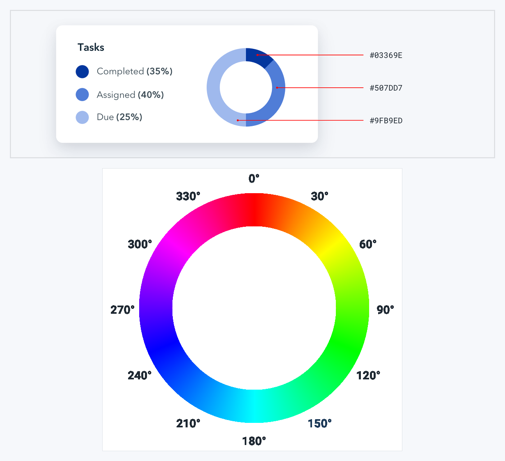
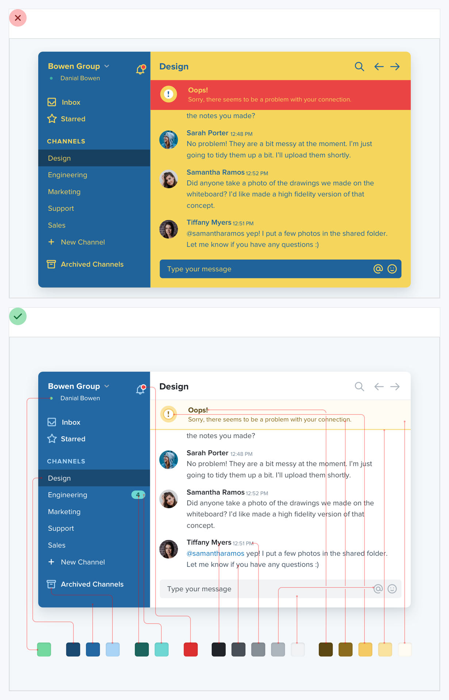
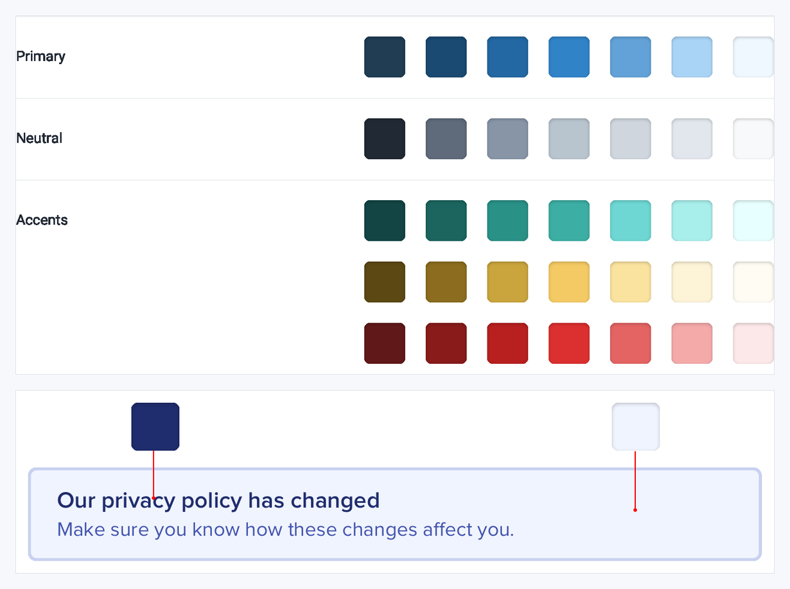
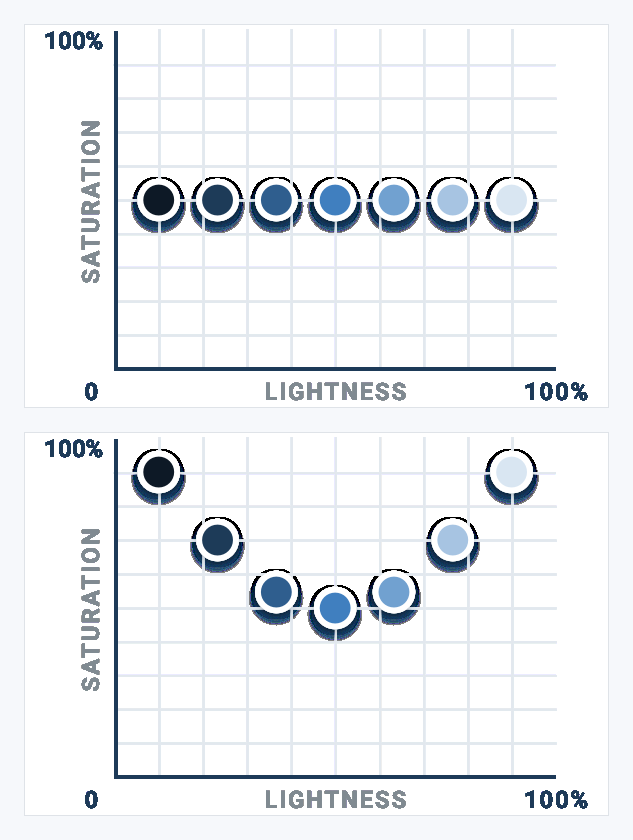
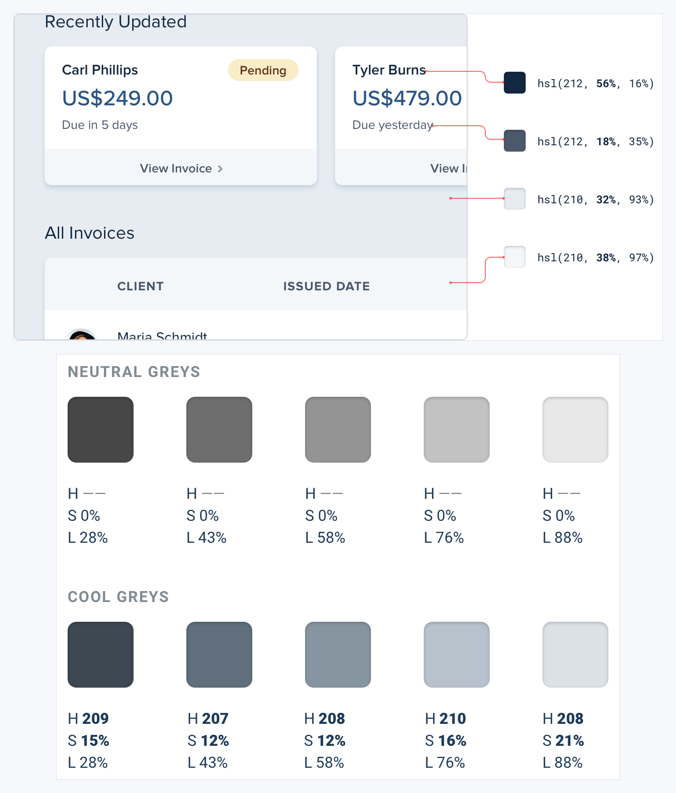
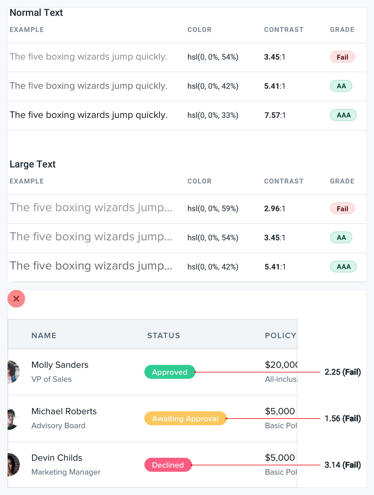
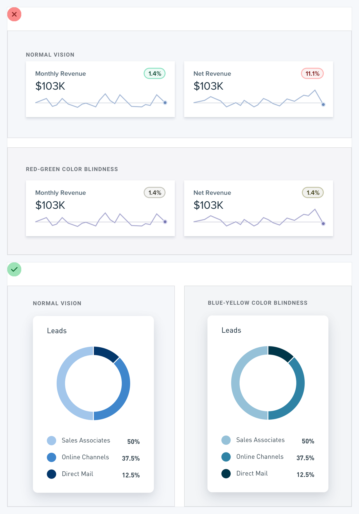

# Visual Atlas: Color Systems

Use these plates to build palettes, preserve hierarchy, and avoid color-only communication.

## Reading rule

- Red `X` = negative example only; green check = corrected reference.
- Diagrams and swatches are system evidence. Do not lift their exact palette unless it fits the product and passes contrast checks.

## 28. Prefer HSL for systematic adjustment

- **Read:** This is an explanatory relationship, not a prescribed palette.
- **Transfer:** Adjust hue, saturation, and lightness intentionally when building related shades and states.

## 29. Use enough colors, not every color

- **Read:** The red rainbow frame is the failure. The green frame uses enough distinct roles without making every region compete.
- **Transfer:** Define primary, neutral, accent, and semantic families; add a role only when the UI needs it.

## 30. Define shades up front

- **Read:** The organized ramps are the positive reference; individual hex values are illustrative.
- **Transfer:** Create named shade steps before component styling so hover, subtle backgrounds, borders, and text stay related.

## 31. Preserve perceived saturation

- **Read:** The straight upper relationship can look washed out at extremes. The curved lower relationship preserves perceived colorfulness.
- **Transfer:** Tune saturation as lightness changes; do not generate a palette by changing only one channel mechanically.

## 32. Use tinted greys

- **Read:** Both ramps are diagnostic; the cool ramp demonstrates how a subtle hue can unify a product surface.
- **Transfer:** Give neutrals a restrained warm or cool bias that matches the brand, while keeping text contrast strong.

## 33. Verify accessible color contrast

- **Read:** In the upper diagnostic table, only rows graded AA or AAA are positive references. The lower red table is a failure and must never be copied.
- **Transfer:** Test text and essential controls at their actual size and weight; fix every failing combination rather than trusting visual taste.

## 34. Do not rely on color alone

- **Read:** The upper red status cards are the negative example. The lower green chart remains distinguishable through lightness, separation, labels, and ordered values.
- **Transfer:** Pair color with text, icons, patterns, position, or value labels for every essential distinction.
