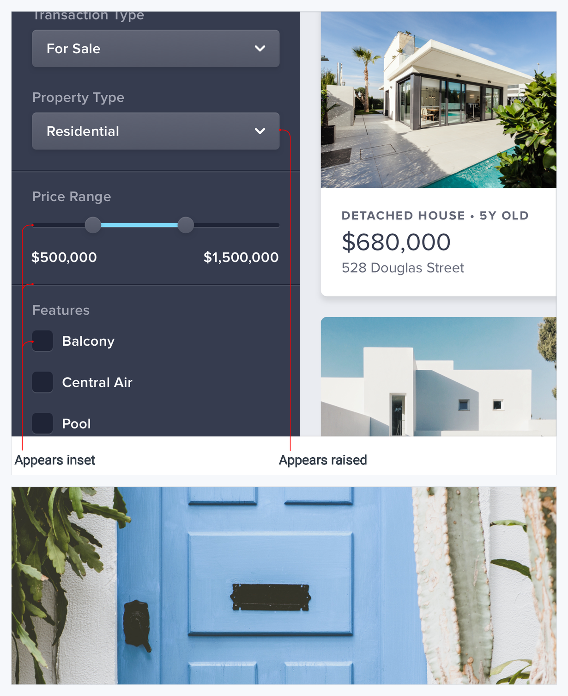
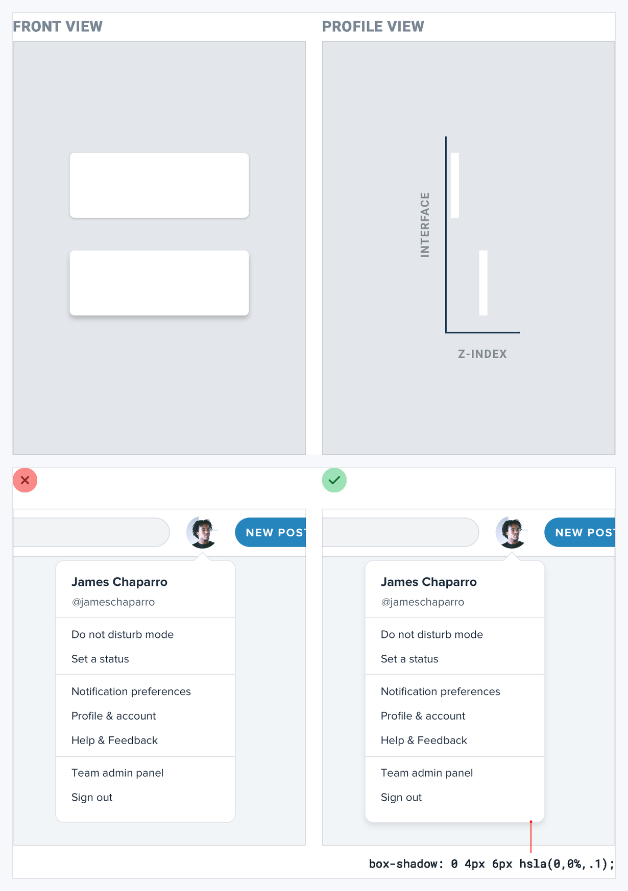
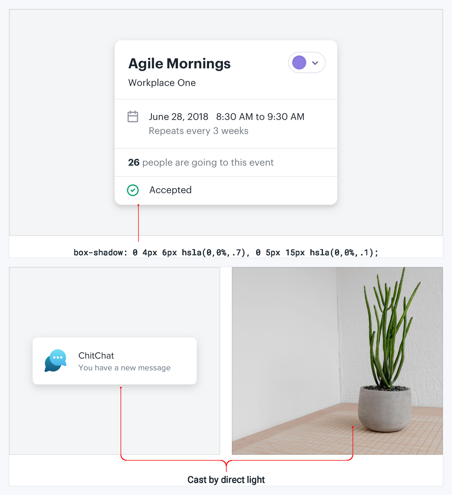

# Visual Atlas: Depth

Use these plates to add spatial meaning without turning every component into a floating card.

## Reading rule

- Red `X` = failure only; green check = corrected reference.
- Unmarked diagrams explain lighting or elevation relationships rather than a style to reproduce literally.

## 35. Emulate a consistent light source

- **Read:** The useful reference is the consistency between highlights and shadows across raised and inset controls.
- **Transfer:** Pick one light direction and keep shadow offsets, inset highlights, and surface edges coherent.

## 36. Use shadows to show elevation

- **Read:** The lower red menu lacks separation; the lower green menu uses shadow to explain that it sits above the page.
- **Transfer:** Map a small elevation scale to real spatial relationships such as dropdowns, sticky bars, and modals.

## 37. Build two-part shadows

- **Read:** The formula and object example are a positive construction reference, not required numeric values.
- **Transfer:** Combine a soft low-opacity ambient shadow with a tighter directional shadow for believable depth.

## 38. Create depth in flat design

- **Read:** Both examples demonstrate restrained separation rather than decorative floating cards everywhere.
- **Transfer:** Prefer surface color, overlap, and subtle edge contrast before increasing shadow intensity.

## 39. Use overlap to communicate layers

- **Read:** Ignore the red disconnected frame. The green frames use controlled overlap to connect content across layers.
- **Transfer:** Let one purposeful element cross a boundary when it clarifies hierarchy; protect clipping and responsive behavior.
