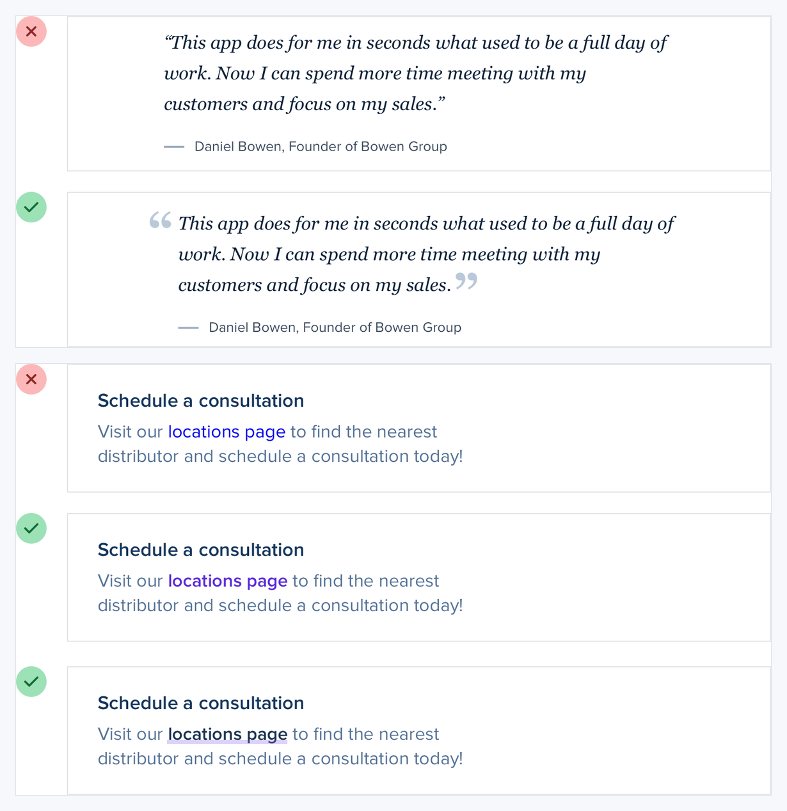
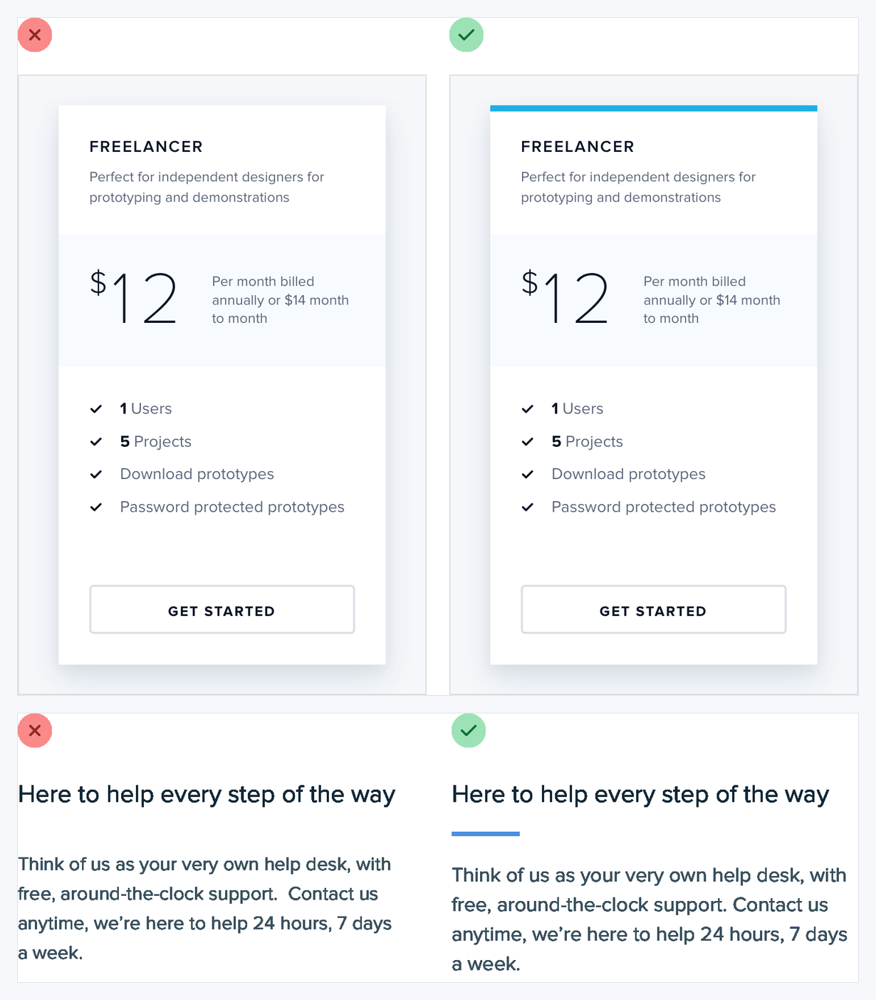
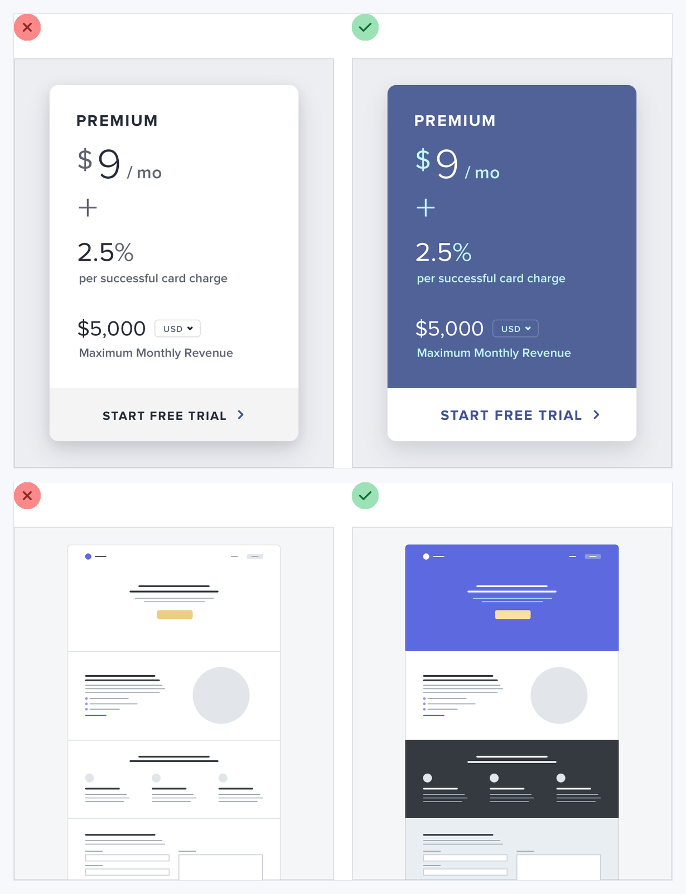
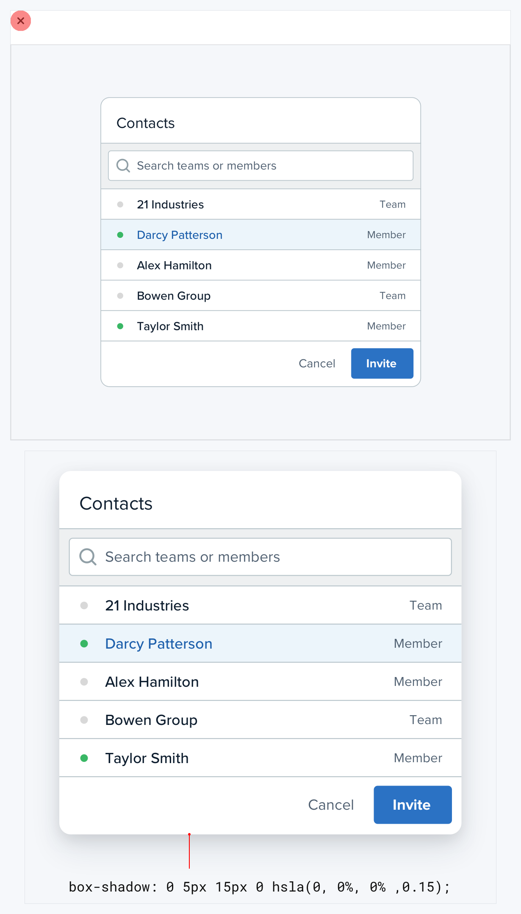
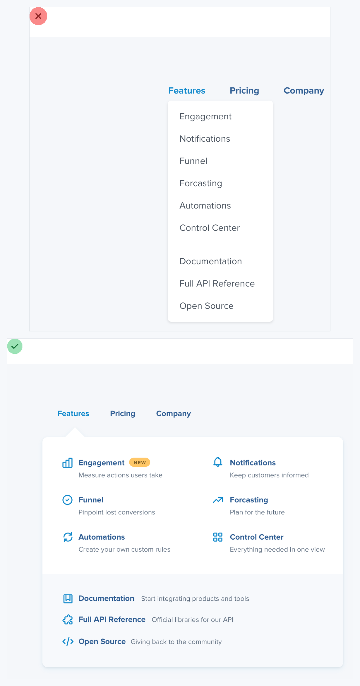
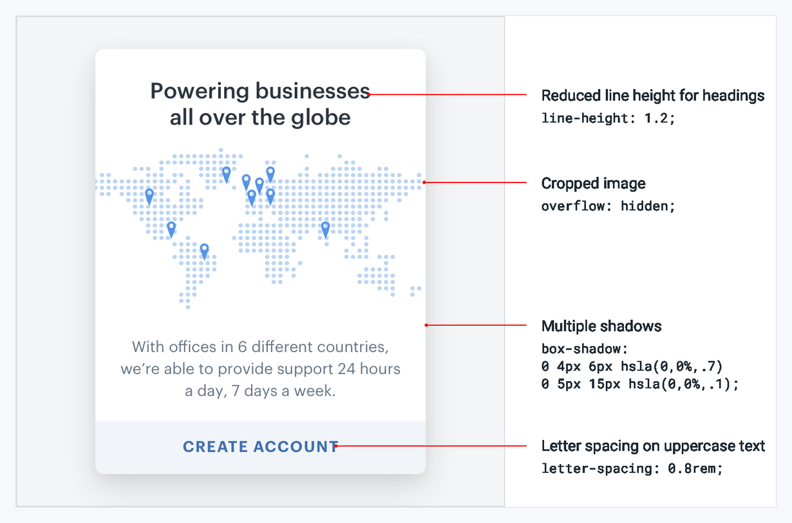

# Visual Atlas: Finishing and Practice

Use these plates after task flow, hierarchy, typography, and responsiveness already work.

## Reading rule

- Red `X` = negative example only; green check = corrected reference.
- Unmarked study examples are prompts for analysis, not universal visual targets.

## 44. Supercharge the defaults

- **Read:** Red frames are untreated defaults. Green frames use spacing, type, and small accents to improve familiar elements without inventing new components.
- **Transfer:** Refine base text, links, lists, quotes, and form controls before adding decorative widgets.

## 45. Add accent borders selectively

- **Read:** The green frames are the target relationship: one restrained edge creates emphasis. Do not copy the red plain or arbitrary treatment as the exemplar.
- **Transfer:** Use an accent border on one meaningful edge or state, not as a box around everything.

## 46. Decorate backgrounds to support grouping

- **Read:** The red frames feel unfinished or weakly grouped. Green frames use background treatment to create atmosphere and section separation.
- **Transfer:** Add subtle color, gradients, illustration, or texture only where it strengthens composition and contrast.

## 47. Design empty states

- **Read:** The upper populated frame supplies context; it is not the empty-state target. The lower green frame is the reference because it explains the absence and offers the next action.
- **Transfer:** Preserve page structure, say what is missing, and provide the most useful next step.

## 48. Use fewer borders

- **Read:** The upper red border-heavy frame is the failure. The lower unmarked frame is the corrected reference: grouping comes from spacing, background, and one elevation cue.
- **Transfer:** Remove borders that merely repeat grouping already expressed by proximity or surface changes.

## 49. Think outside the box

- **Read:** The upper red menu is the negative example. The lower green menu uses grouping and supporting visuals to make choices scannable.
- **Transfer:** Recompose the information architecture when a conventional box/list pattern hides relationships.

## 50. Notice unexpected decisions

- **Read:** These are study prompts, not guaranteed targets. Inspect the unusual dark calendar layer and split-color headline to understand why they work in context.
- **Transfer:** Collect specific compositional decisions and the problems they solve, not just screenshots labeled “beautiful.”

## 51. Rebuild favorite interfaces

- **Read:** The annotated reconstruction is a learning reference, not permission to ship a clone.
- **Transfer:** Recreate a small study privately to understand geometry and CSS, then translate the learned relationships into original product work.
