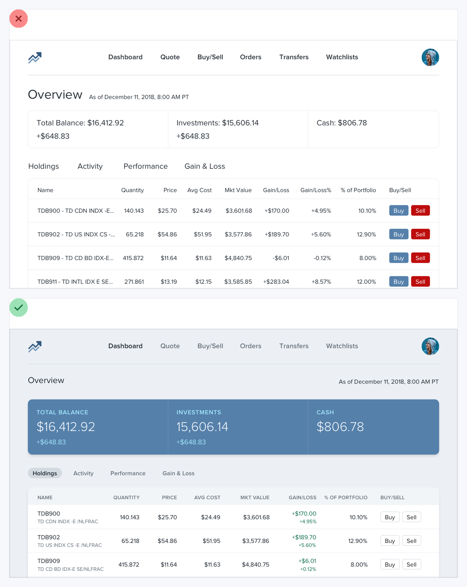
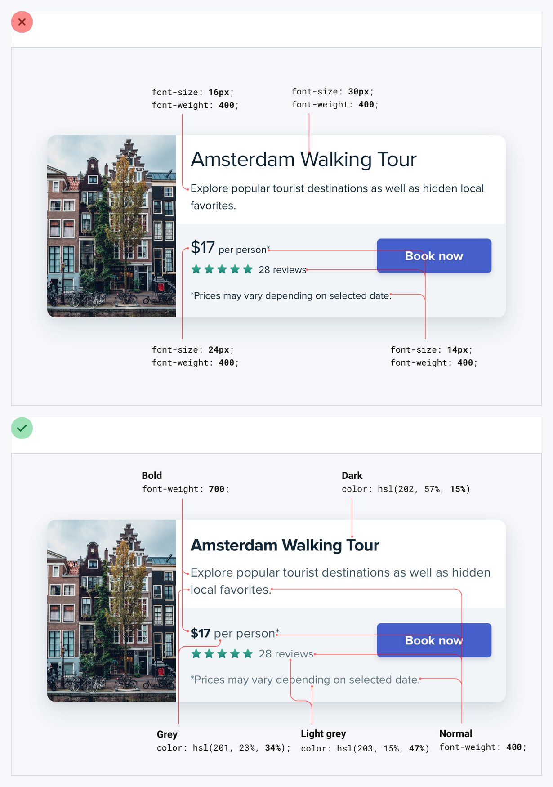
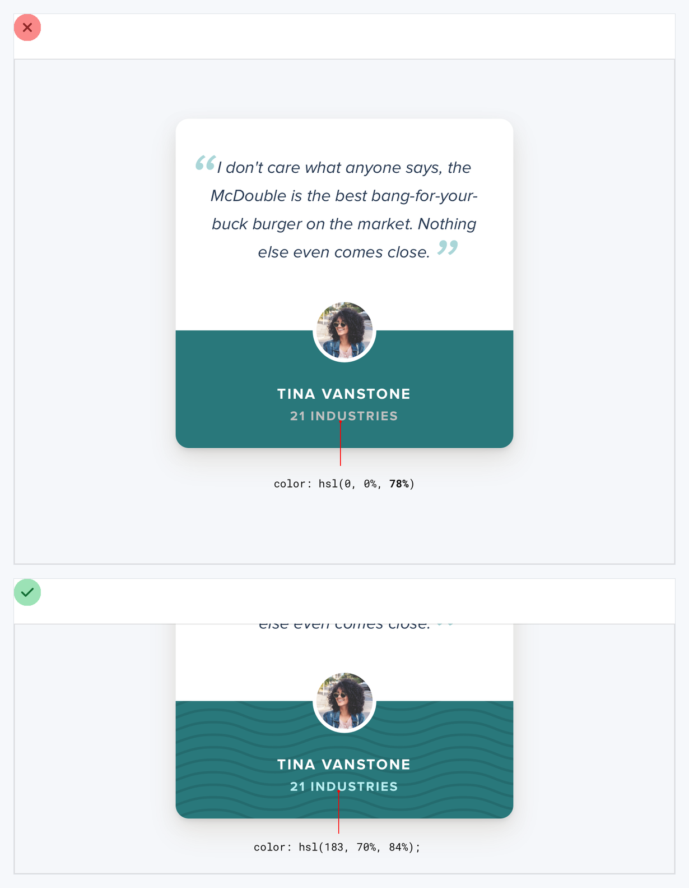
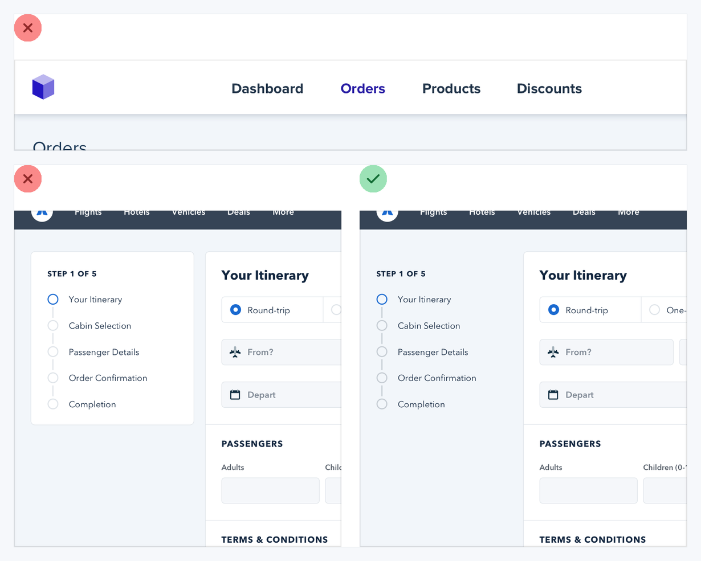
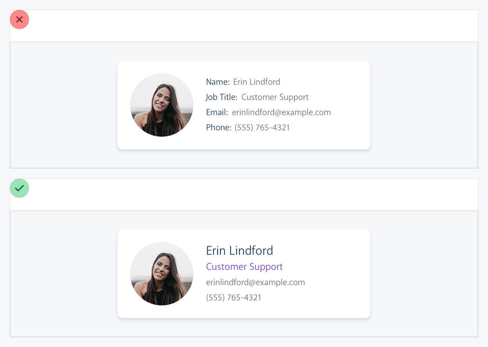
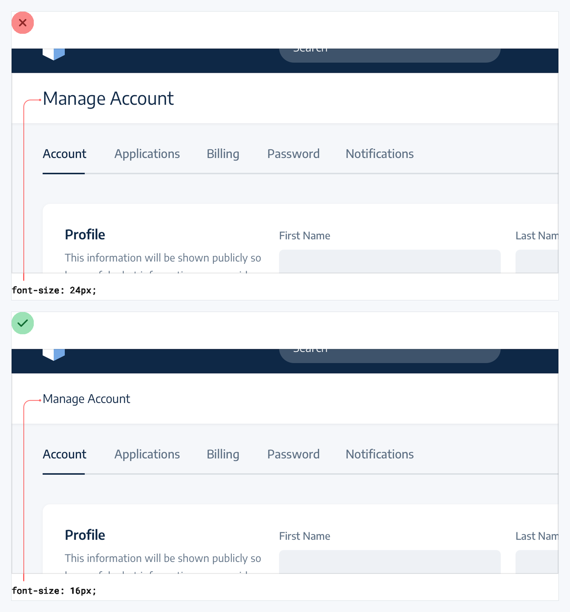
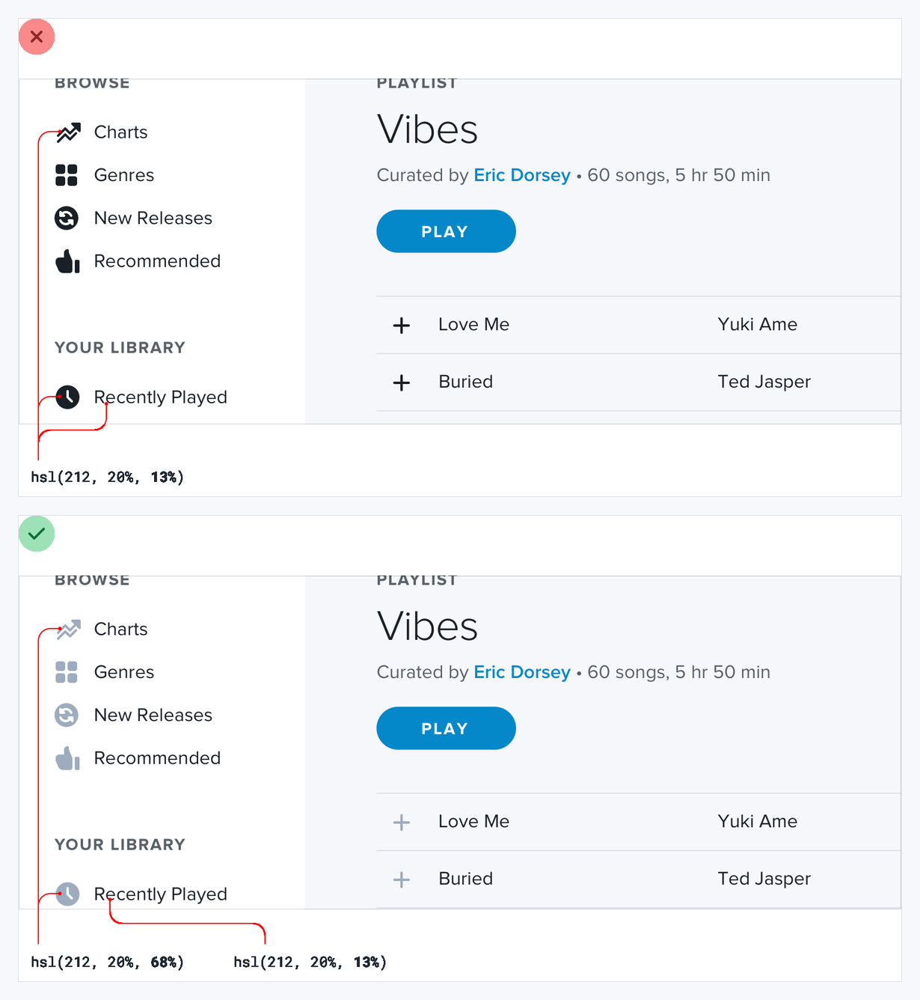
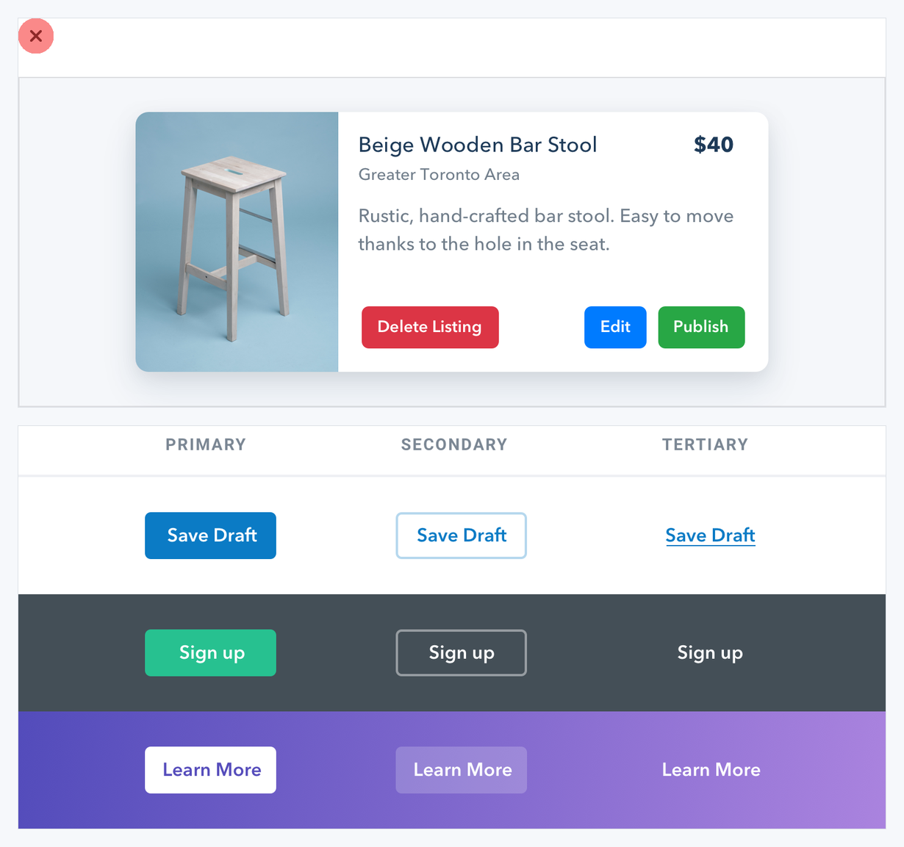

# Visual Atlas: Hierarchy and Actions

Use these comparisons when information and actions compete for attention.

## Reading rule

- Red `X` = failure only; never copy it as the target. Green check = corrected reference.
- If a blue annotation appears, it explains a relationship. It does not automatically mean the whole frame is a final design.

## 6. Not all elements are equal

- **Read:** Ignore the red flat version; follow the green version's stronger summary band and quieter supporting rows.
- **Transfer:** Decide the reading order, then vary contrast, weight, and grouping to encode it.

## 7. Size is not everything

- **Read:** The red frame makes the focal card dominate by raw size. The green frame preserves emphasis while restoring context.
- **Transfer:** Reach for weight, contrast, and spacing before making an element dramatically larger.

## 8. Do not use grey text on colored backgrounds

- **Read:** The upper red frame is a failure. The lower green frame is the reference: lighter text is derived from the background hue and remains legible.
- **Transfer:** On colored surfaces, tune lightness and saturation within the same hue family and verify contrast.

## 9. Emphasize by de-emphasizing

- **Read:** Red-marked frames make too many items equally loud. Follow the green frame, where supporting controls recede.
- **Transfer:** Make the primary item clearer by reducing contrast, weight, or decoration on secondary items.

## 10. Use labels as a last resort

- **Read:** The red labeled card is the negative example. The green card uses value formatting and order to make most labels unnecessary.
- **Transfer:** Let familiar formats, icons with accessible names, and visual hierarchy explain data; keep labels where ambiguity remains.

## 11. Separate visual hierarchy from document hierarchy

- **Read:** The red frame maps semantic heading level directly to visual size. The green frame keeps semantic structure while fitting the page's actual emphasis.
- **Transfer:** Preserve correct HTML headings, but choose visual styles according to local importance.

## 12. Balance weight and contrast

- **Read:** The red navigation is visually heavy. The green version lowers contrast so icons support rather than overpower labels and content.
- **Transfer:** If an element is inherently bold, reduce its color contrast or size instead of letting it dominate.

## 13. Treat semantics as secondary to hierarchy

- **Read:** The red product card gives every action a loud semantic color. The lower role-based examples are the reference.
- **Transfer:** Encode primary, secondary, and tertiary importance first; reserve destructive or status color for moments where its meaning is necessary.
