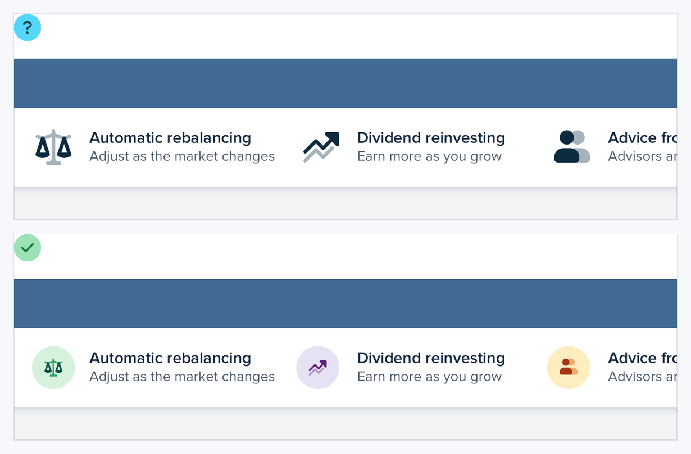

# Visual Atlas: Images

Use these figures for photography, text overlays, icons, and unpredictable user content.

## Reading rule

- Red `X` = negative example only; green check = corrected reference.
- A blue `?` indicates a diagnostic or undecided treatment, not an exemplar.

## 40. Use good photos

- **Read:** The left red listing is the failure. The right green listing is the target relationship: the image communicates the offer clearly and attractively.
- **Transfer:** Prefer relevant, well-lit, well-composed imagery; do not expect layout tricks to rescue a poor source photo.

## 41. Keep text contrast consistent over images

- **Read:** The upper red hero loses contrast over changing image regions. The lower green hero creates a stable contrast surface.
- **Transfer:** Use an overlay, gradient, text container, or art-directed crop and test the worst image, not only the demo image.

## 42. Respect an image's intended size

- **Read:** The upper blue-question frame is diagnostic, not a target. The lower green frame keeps source icons at a suitable size and gives them visual presence through containers.
- **Transfer:** Do not upscale small raster or simple icon assets until they look weak; add a supporting shape or source a proper asset.

## 43. Control user-uploaded content

- **Read:** The upper red masonry-like result is the failure. The lower fixed card with a controlled cover crop is the corrected reference even though it has no green marker.
- **Transfer:** Define aspect ratio, crop behavior, fallback, focal point, and overflow for arbitrary uploads.
