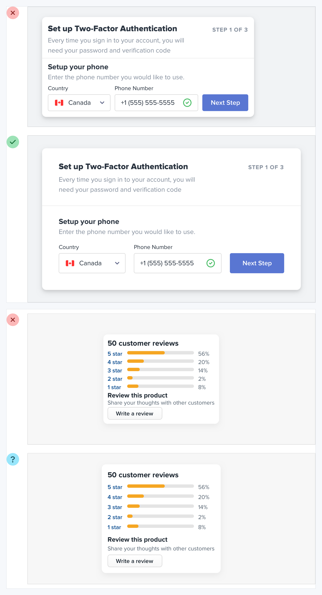
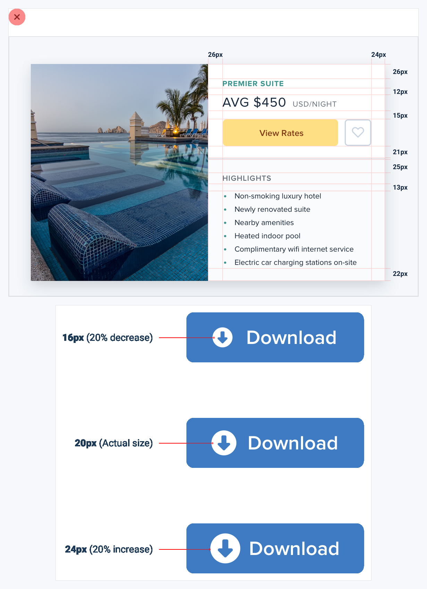
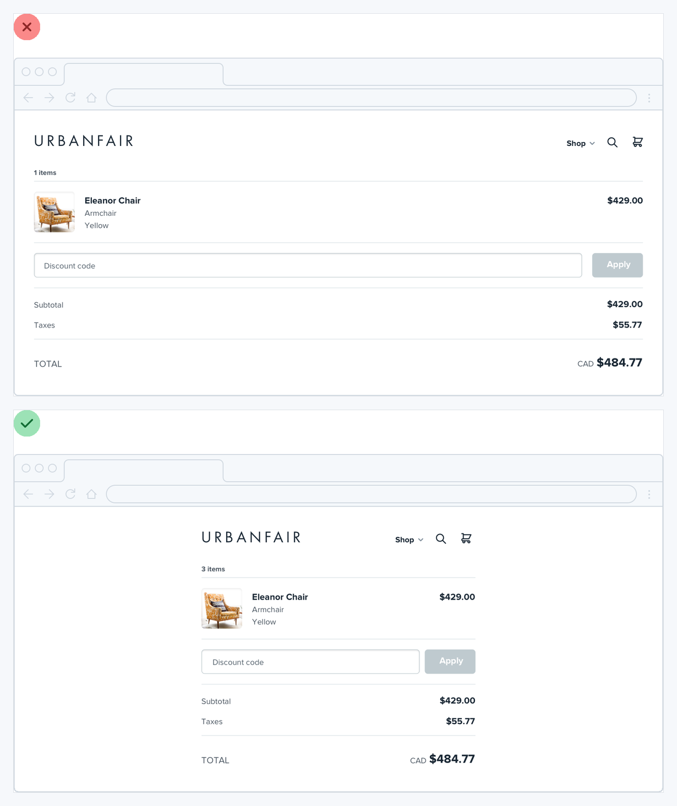
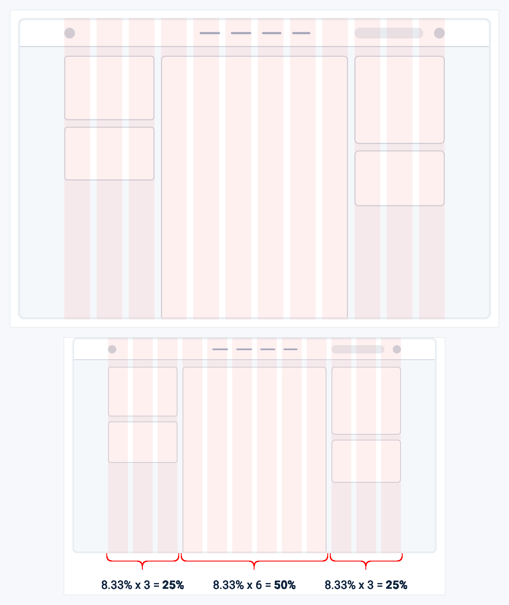
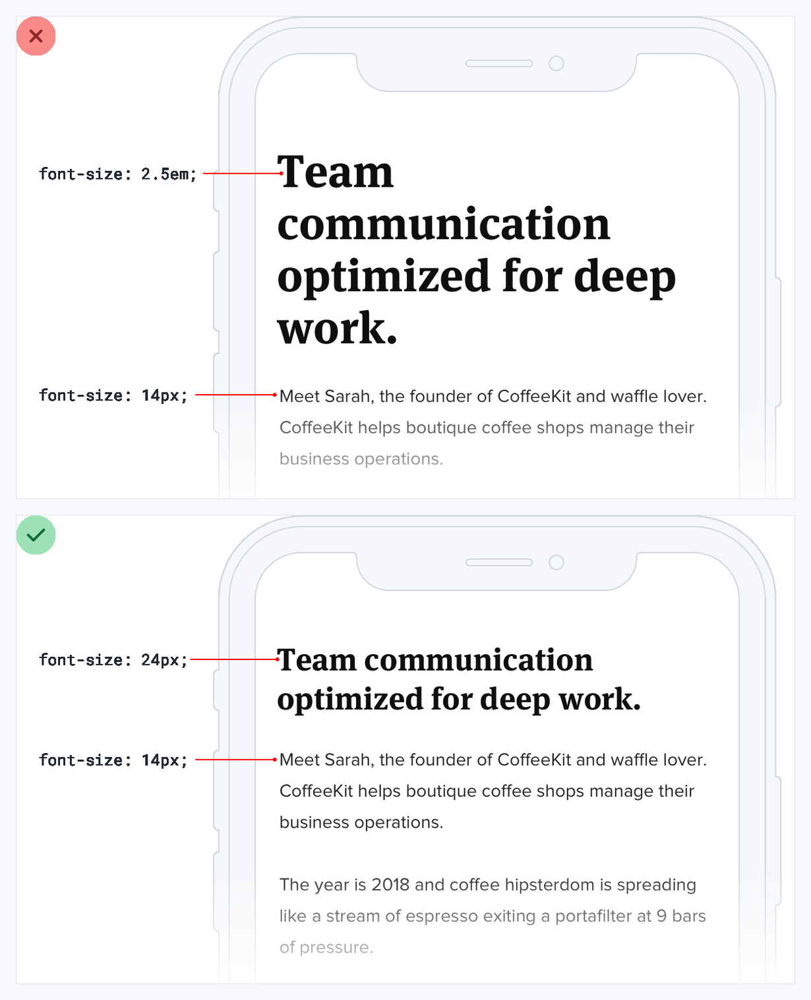
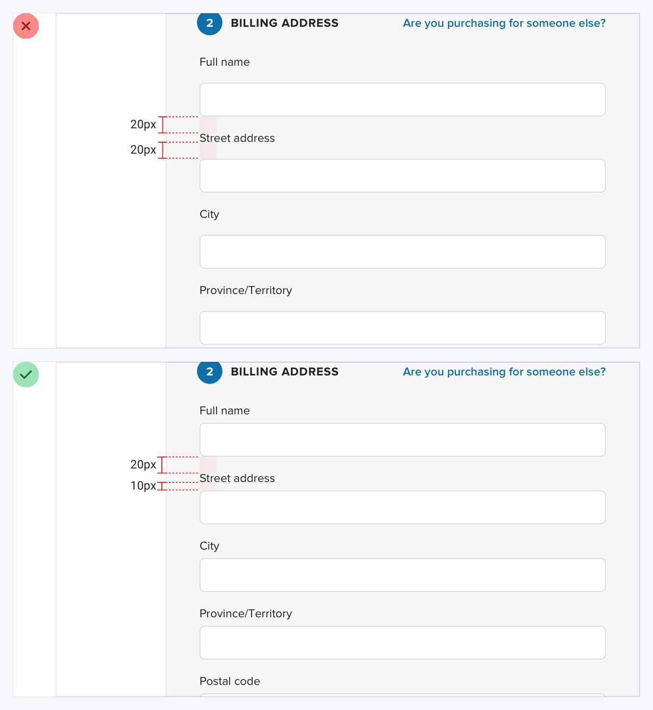

# Visual Atlas: Layout and Spacing

Use these plates to diagnose density, grouping, width, and responsive composition.

## Reading rule

- Red `X` = negative example only. Green check = corrected reference.
- Unmarked diagrams explain a system; copy the relationship, never the exact measurements blindly.

## 14. Start with too much whitespace

- **Read:** Discard the red cramped frames. The green or blue-marked frames show the intended breathing room and grouping.
- **Transfer:** Begin spacious, then tighten deliberately; recovering clarity from a cramped layout is harder.

## 15. Establish a spacing and sizing system

- **Read:** The scale relationships are the positive reference; the printed pixel values are illustrative, not mandatory.
- **Transfer:** Use a small nonlinear token scale for gaps, padding, control heights, and icon sizes.

## 16. Do not fill the whole screen by default

- **Read:** The red frame stretches sparse content across the viewport. The green frame limits width and keeps related information close.
- **Transfer:** Size containers to the content's reading and comparison needs, not to available pixels.

## 17. Grids are overrated

- **Read:** This is a neutral explanatory diagram, not a final screen. It shows that relationships can use different fractions within one layout.
- **Transfer:** Use grid when it clarifies alignment, but let content needs determine track sizes and exceptions.

## 18. Relative sizing does not scale automatically

- **Read:** The upper red phone is the failure; the lower green phone is the target relationship with a deliberate mobile heading size.
- **Transfer:** Do not assume a desktop type ratio remains usable at every breakpoint; tune important steps explicitly.

## 19. Avoid ambiguous spacing

- **Read:** The red form uses equal gaps above and below a label, making ownership unclear. The green form keeps the label closer to its field.
- **Transfer:** Spacing must reveal grouping: intra-group gaps should be visibly smaller than inter-group gaps.
