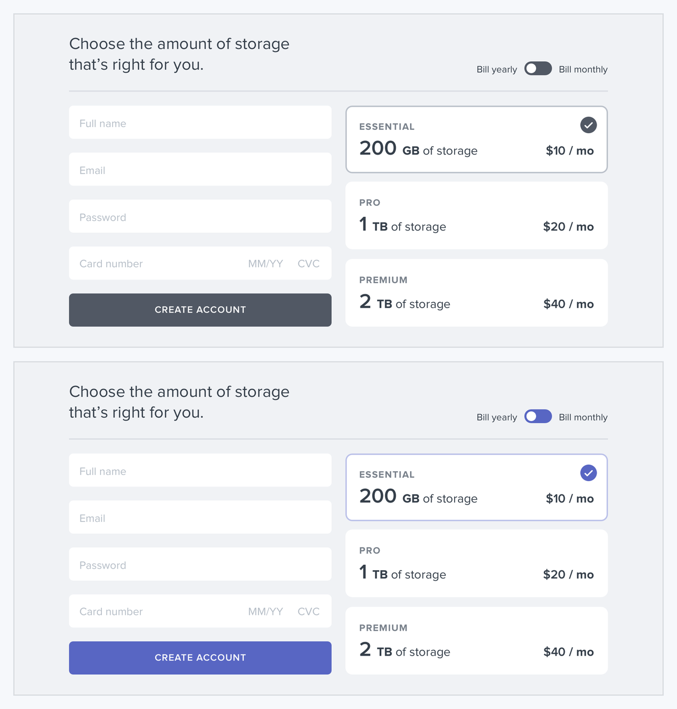
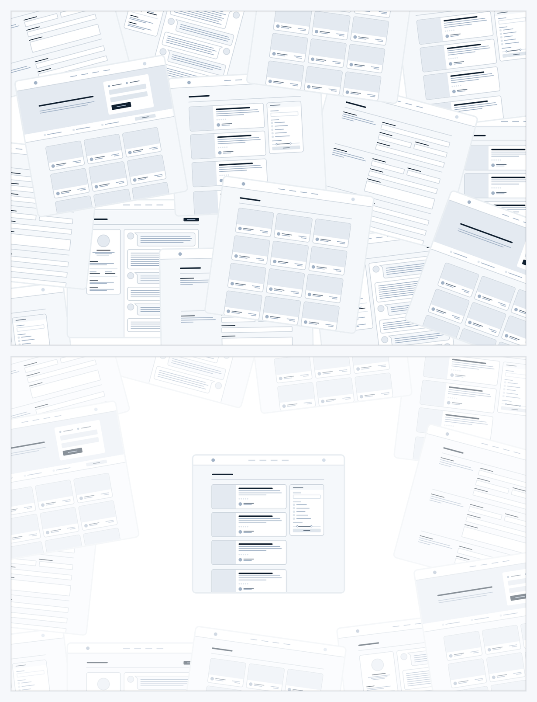
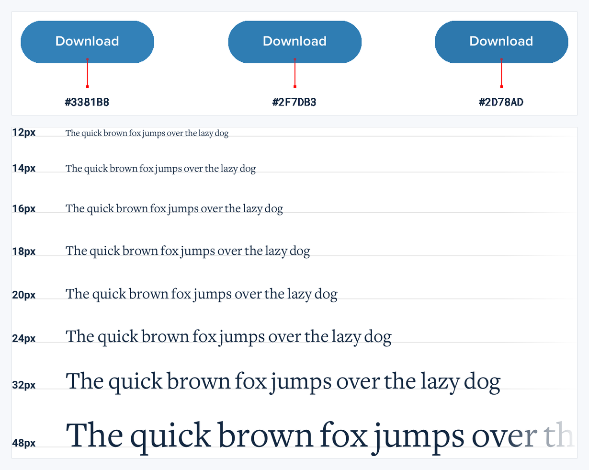

# Visual Atlas: Starting from Scratch

Use these figures to decide how to begin and how much visual direction to establish before polishing. They are principle references, not templates to clone.

## Reading rule

- A red `X` is a negative example and must never be used as the target.
- A green check is the corrected reference. Blue `?` or annotation marks are diagnostic, not endorsements.
- When a plate has no red/green markers, the note below names the intended relationship explicitly.

## 1. Start with a feature, not the shell

- **Read:** The upper shells are unanswered layout questions, not exemplars. The lower flight search is the useful reference because it starts from one concrete job.
- **Transfer:** Make the core task and its primary action work before designing navigation, sidebars, or decorative chrome.

## 2. Detail comes later

- **Read:** Both frames are valid stages; the upper neutral pass proves structure, and the lower frame adds emphasis after hierarchy is stable.
- **Transfer:** Validate layout, grouping, and flow in low fidelity before spending time on color and polish.

## 3. Design in short cycles

- **Read:** The collage is process evidence, not a catalog to copy. The useful pattern is repeated small decisions converging on a coherent result.
- **Transfer:** Implement a narrow slice, render it, correct the largest visual problem, and repeat.

## 4. Choose a personality

- **Read:** Neither direction is the universal winner. The dark photographic surface and the light illustrative surface are two internally consistent personalities.
- **Transfer:** Choose typography, color, imagery, radius, and density from one product-appropriate direction instead of mixing moods arbitrarily.

## 5. Limit your choices

- **Read:** The small set of related colors and sizes is the positive reference; it demonstrates constraints, not mandatory values.
- **Transfer:** Define a compact token scale before styling components, then prefer tokens over new one-off values.
