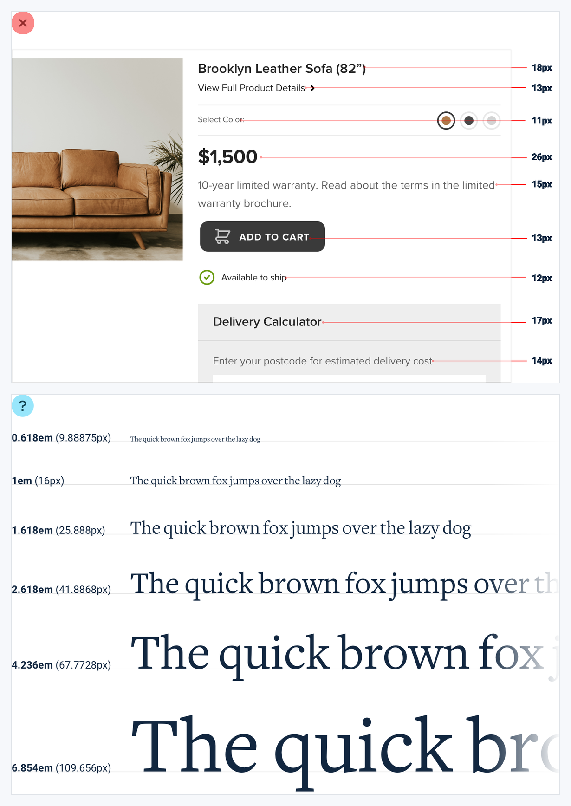
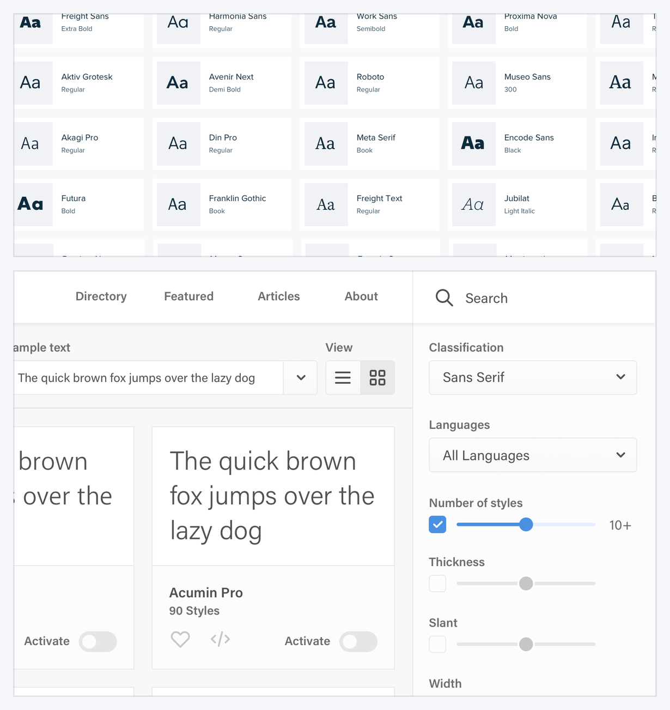
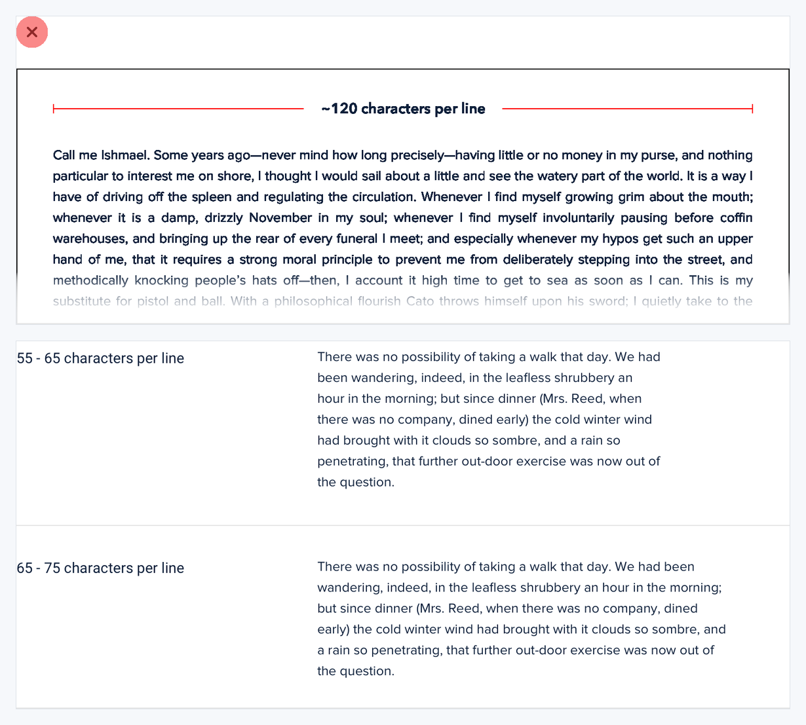
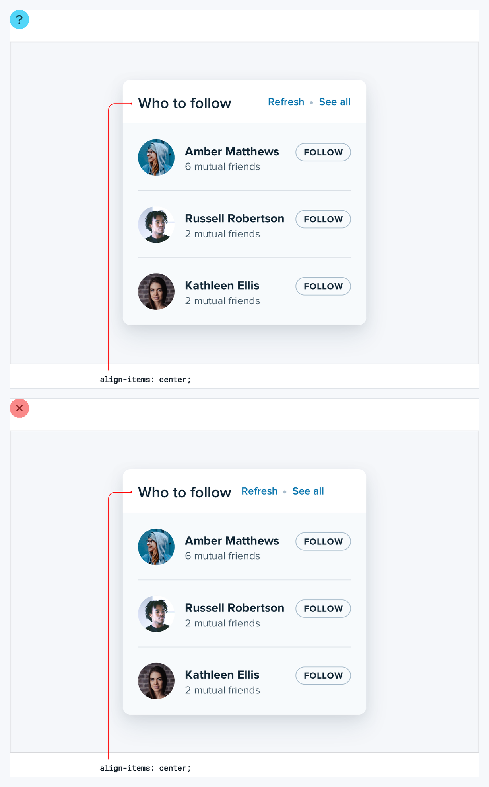
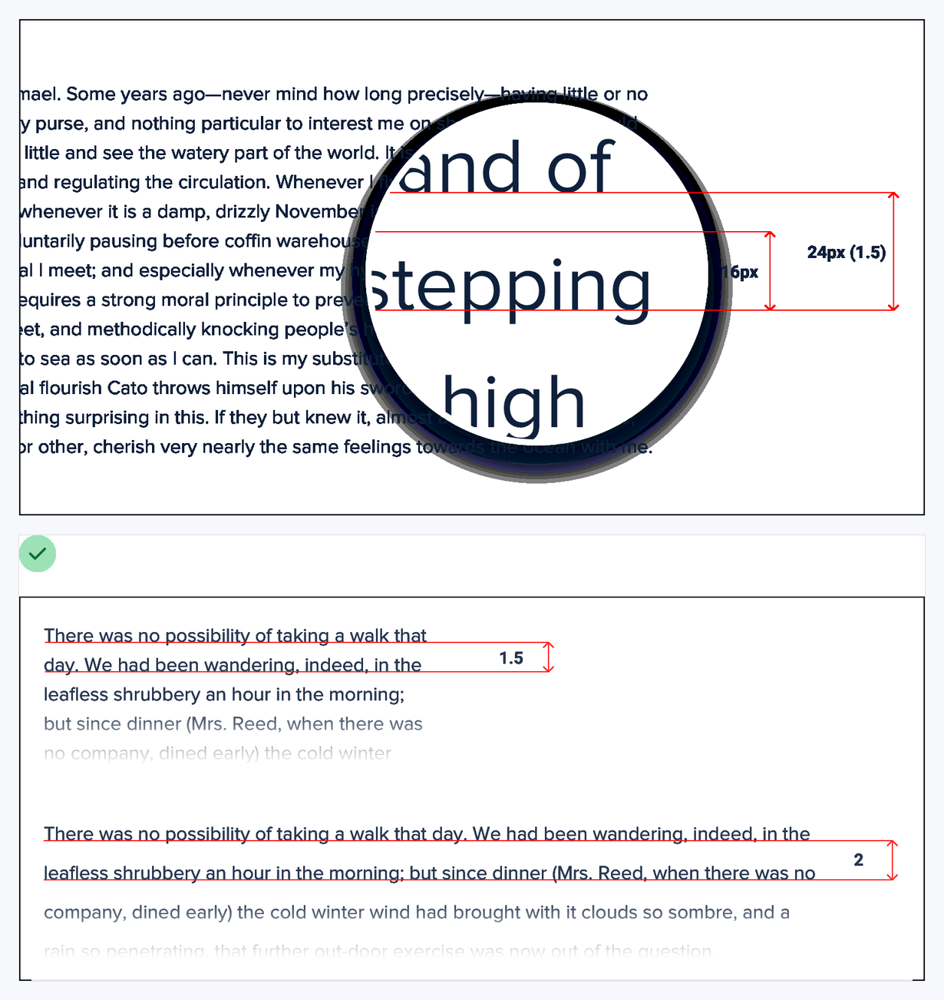
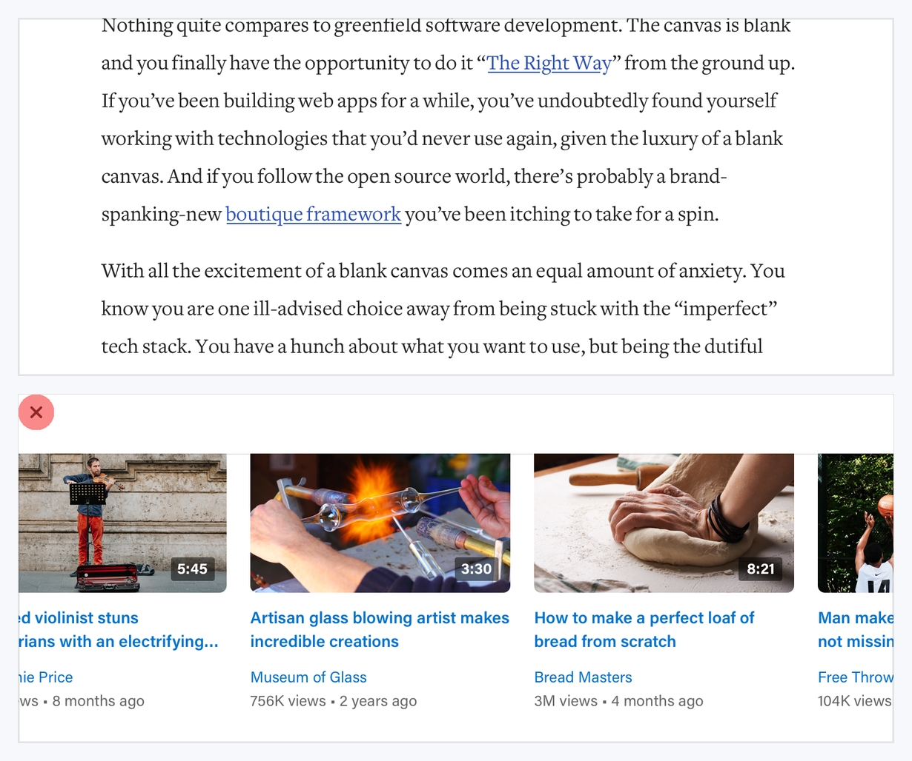
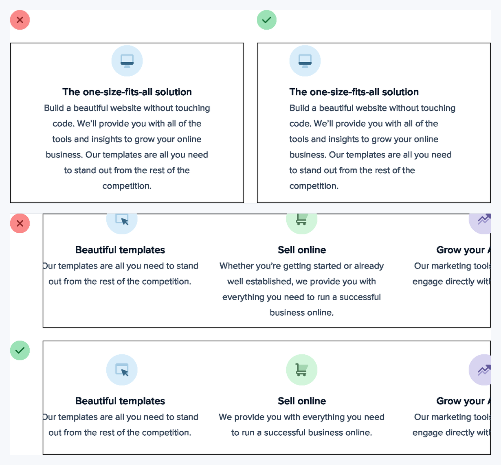
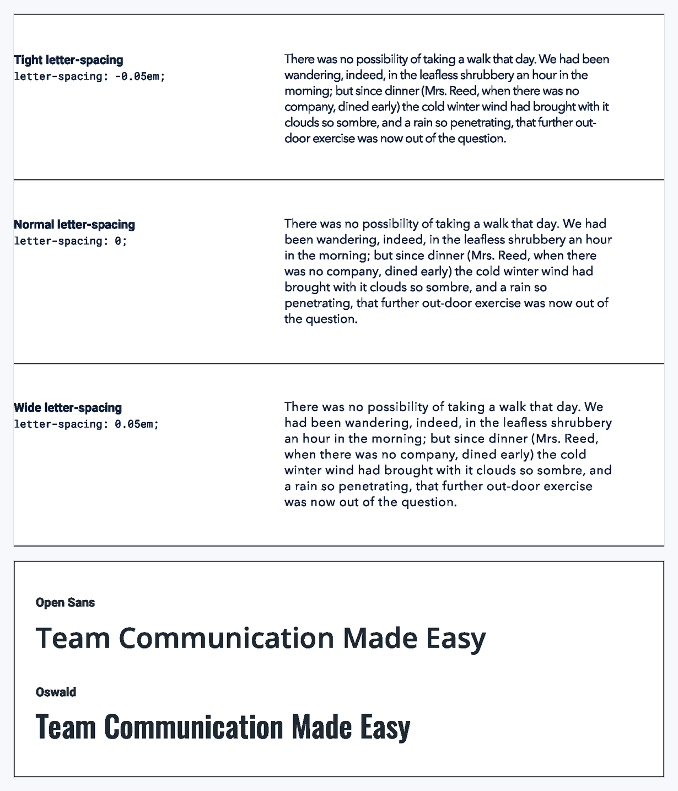

# Visual Atlas: Text and Typography

Use these figures when selecting type, building a scale, or correcting readability.

## Reading rule

- Red `X` = negative example only; green check = corrected reference.
- Unmarked specimens demonstrate a range or tool. They are evidence for a decision, not a ready-made type system.

## 20. Establish a type scale

- **Read:** Ignore the red accumulation of one-off sizes; use the systematic specimen as evidence for a constrained scale.
- **Transfer:** Name a small set of roles and reuse their size/line-height pairs consistently.

## 21. Use good fonts

- **Read:** This plate demonstrates comparison, not one prescribed family.
- **Transfer:** Choose a typeface with the weights, glyph coverage, readability, and product tone the interface actually needs.

## 22. Control line length

- **Read:** The red 120-character line is the failure. The shorter 55–65 and broader 45–75 ranges are the usable references.
- **Transfer:** Constrain prose width independently from the page container; test with realistic long copy.

## 23. Align mixed text by baseline, not by box center

- **Read:** The annotated upper list is the useful relationship. The lower red list centers boxes but makes text feel misaligned.
- **Transfer:** Align text-bearing elements by baseline or optical rhythm when geometric centering looks wrong.

## 24. Make line height proportional to text size

- **Read:** The red dense setting is a failure. Follow the green examples: smaller text needs proportionally more leading; large display text needs less.
- **Transfer:** Store line height with each type token instead of applying one global ratio.

## 25. Links do not always need color

- **Read:** The upper prose link is an appropriate contextual treatment. The lower red frame is the failure because nearly every text fragment competes in link blue.
- **Transfer:** Make links discoverable through context, underline, weight, or interaction states; do not color entire dense surfaces indiscriminately.

## 26. Align text for readability

- **Read:** Discard the red centered or uneven treatments. The green frames provide stable left edges and easier scanning.
- **Transfer:** Center short display copy sparingly; left-align paragraphs, lists, and repeated cards.

## 27. Tune letter spacing deliberately

- **Read:** These are comparative specimens, not three equally correct defaults. Fit depends on typeface, case, size, and role.
- **Transfer:** Tighten large headings cautiously, keep body copy near the font default, and add tracking to small uppercase labels when needed.
